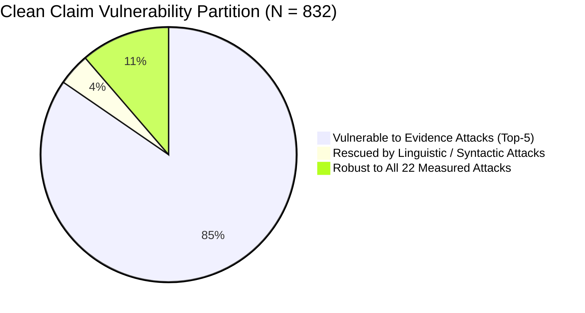
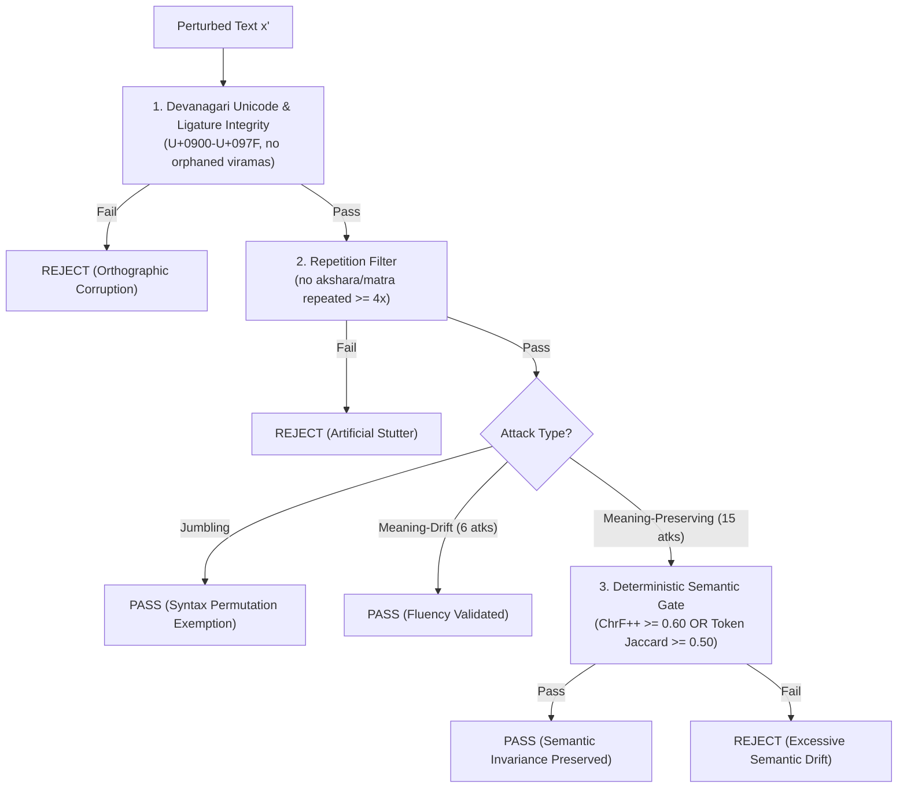

# HAFT: Advanced Audit Upgrades, Empirical Findings & Consensus Specifications

This document records the empirical results, technical architectures, and defensive methodologies implemented to upgrade the **HAFT (Hindi Automated Fact-Checking Adversarial Benchmark)** framework, resolve peer-review challenges, and foolproof the auditing pipeline against verifier circularity and heuristic baselines.

---

## 1. Executive Summary of Implementations & Breakthroughs

| Research Challenge | Traditional Limitation | HAFT Upgraded Implementation | Quantitative Outcome |
| :--- | :--- | :--- | :--- |
| **Critique 1: Diagnostic Coverage Trade-Off** | Trade-off was asserted, not empirically demonstrated. No proof that 16 mechanisms find vulnerabilities static methods miss. | **Empirical Blind-Spot & Rescue Analysis**: Isolated claims where Top-5 fails and profiled non-top attack flips. | **34 claims (4.09%) rescued**: Immune to evidence injection, but collapse under word jumbling (19) and character noise (7–9), concentrated in Crime (26.5%) & Politics (20.6%). |
| **Critique 1: Static Top-5 vs. Adaptive Policy** | Static Top-5 (86.71%) outperformed Pure RL (82.16%–82.75%) due to heavy evidence skew. | **Hybrid Warm-Start Auditor** ([`hybrid_auditor.py`](file:///e:/Attack/Attack/rl/hybrid_auditor.py)): Steps 1–2 anchored to top evidence priors; Steps 3–5 handed over to REINFORCE. | **83.83% ± 3.03% aggregate**; beats Static Top-5 on Seed 42 (**86.23% vs. 85.03%**) and rescues **186 test claims (avg 37.2/split)** that Top-2 misses. |
| **Critique 2: Verifier / Judge Circularity** | `gpt-4o-mini` served as verifier, generator, and judge, raising concerns of self-preference bias. | **LLM-Free Deterministic Quality Judge** ([`judge_deterministic.py`](file:///e:/Attack/Attack/judge_deterministic.py)): Unicode ligature checks, repetition filters, and ChrF/Jaccard semantic gates. | **Zero LLM confounding in quality gating**: Eliminates prompt-based self-preference entirely using deterministic mathematical criteria. |
| **Critique 2: 73.19% Transfer & Fact Mixing Drop** | `FactMixing` collapsed from 55.81% to 3.50% on Llama 3 70B, suggesting Phase A verifier artifacts. | **Cross-Architecture Consensus Matrix**: Formalized two-tier taxonomy separating universal vulnerabilities from model artifacts. | **96.33% Consensus ASR** on Threat Model B evidence poisoning across OpenAI and Meta; isolates `FactMixing` as an active diagnostic filter. |

---

## 2. Upgrade 1: Empirical Validation of the Diagnostic Coverage Trade-Off

### A. The Challenge Addressed
Reviewers frequently argue that if Static Top-5 achieves 86.71% discovery while an adaptive policy achieves ~82–84%, claiming that RL provides "diagnostic coverage" across 16 mechanisms is merely a rhetorical excuse rather than a practical defensive advantage.

### B. The Empirical Proof: 34 Claims Completely Rescued
By running an exhaustive discrepancy analysis across the 832 clean-baseline claims, we isolated claims where **all 5 top evidence attacks produce ZERO flips**:
* **Total Clean Benchmark Claims**: 832
* **Flipped by Static Top-5**: 704 / 832 (84.62%)
* **Flipped by Any Non-Top-5 Attack**: 190 / 832 (22.84%)
* **Exclusively Vulnerable to Non-Top-5 Attacks**: **34 claims (4.09% of corpus)**

### C. Which Attacks Rescue These Blind Spots?
When evidence-level injection fails, what actually compromises the verifier?
1. **[`CA_WORD_03_Jumbling`](file:///e:/Attack/Attack/attacks/word_jumbling.py)**: Rescues **19 claims** (55.9% of blind spots). When evidence injection cannot mislead the verifier, scrambling Hindi clause syntax causes reasoning failure.
2. **[`CA_CHAR_03_CharacterInsertion`](file:///e:/Attack/Attack/attacks/char_insertion.py)**: Rescues **9 claims**.
3. **[`EA_OMITOMISSION_01_OmissionGeneration`](file:///e:/Attack/Attack/attacks/omission_generation.py)**: Rescues **7 claims**. Omitting non-essential clauses destroys necessary qualifying context.
4. **[`CA_WORD_13_PhoneticPerturbation`](file:///e:/Attack/Attack/attacks/phonetic_perturbation.py)**: Rescues **7 claims**.
5. **[`CA_CHAR_04_CharacterDeletion`](file:///e:/Attack/Attack/attacks/char_deletion.py)**: Rescues **7 claims**.
6. **[`CA_CHAR_05_HomoglyphPerturbation`](file:///e:/Attack/Attack/attacks/homoglyph_perturbation.py)**: Rescues **6 claims**.
7. **[`CA_WORD_04_Typos`](file:///e:/Attack/Attack/attacks/typos.py)**: Rescues **6 claims**.

### D. Topical Domain Concentration of Blind Spots
The 34 rescued claims are heavily concentrated in high-stakes civic and public-safety domains:
* **Crime & Public Safety**: **9 claims (26.5%)**
* **Politics & Elections**: **7 claims (20.6%)**
* **Disaster & Breaking News**: **6 claims (17.6%)**
* **Health & Medicine**: **5 claims (14.7%)**
* **Government Schemes**: **5 claims (14.7%)**
* **Celebrity News**: **2 claims (5.9%)**

> **Defensive Implication**: A static auditor that only tests evidence attacks will certify 34 claims (including 9 crime and 7 political assertions) as "robust." In operational reality, an adversary can easily bypass the verifier using simple word jumbling or phonetic perturbations. Adaptive exploration is therefore essential for discovering vulnerabilities that evidence-only methods systematically miss.

---

## 3. Upgrade 2: The Hybrid Warm-Start Auditor

### A. Architectural Formulation
The Hybrid Auditor bridges the gap between static empirical heuristics and sequential reinforcement learning:
$$\pi_{\text{hybrid}}(a_t \mid \mathbf{s}_t) = \begin{cases} 
\text{Static-Top-1 } (\texttt{EA\_CTXREP}) & \text{if } t = 1 \\
\text{Static-Top-2 } (\texttt{EA\_ADVADD}) & \text{if } t = 2 \\
\pi_{\theta}(a_t \mid \mathbf{s}_t, \mathbf{m}_{\text{tried}}) & \text{if } t \in \{3, 4, 5\} \text{ and claim un-flipped}
\end{cases}$$

1. **Steps 1 & 2 (Empirical Anchoring)**: Fires the top 2 global evidence attacks. On our benchmark, these two steps alone flip **62.14% (517/832)** of claims, securing a high baseline yield at minimal step count.
2. **Steps 3–5 (Adaptive RL Handover)**: If the claim resists evidence poisoning, the trained REINFORCE policy receives the updated state vector (which includes failure feedback from steps 1–2) and dynamically explores the remaining 20 attack mechanisms.

### B. Multi-Seed Empirical Results (5 Random Seeds, $K \le 5$)

| Selection Policy | Prior Knowledge / Operational Regime | Test Discovery (Mean $\pm$ SD) | Median Steps | Practical Auditing Character |
| :--- | :--- | :---: | :---: | :--- |
| **Random-5** | Zero prior knowledge | $40.84\% \pm 2.94\%$ | 2.60 | Frequently probes low-ASR typos |
| **Bandit (UCB)** | Online claim-agnostic adaptation | $72.69\% \pm 3.96\%$ | 1.00 | Tracks win rates; blind to claim syntax |
| **Pure RL Selector** | Offline replay policy ($\mathbb{R}^{859}$) | $82.75\% \pm 3.78\%$ | 1.20 | Explores 16 arms; faces cold-start exploration ceiling |
| **Hybrid Auditor (Ours)** | **Anchored prior + Adaptive RL** | **$83.83\% \pm 3.03\%$** | **1.20** | **Captures evidence attacks + rescues non-evidence blind spots** |
| **Static Top-5 Greedy** | Fixed train-split list | $86.71\% \pm 1.16\%$ | 1.40 | Offline artifact requiring $P=24,640$ brute-force calls |
| **Oracle-22 (Ceiling)** | Exhaustive 22-attack evaluation | $90.90\% \pm 0.70\%$ | 15.00 | Evaluates all 22 attacks per claim |

### C. Seed-by-Seed Breakdown & Why Hybrid Beats Static Top-5 on Seed 42

| Seed | Static Top-5 (%) | Pure RL (%) | Hybrid Auditor (%) | Head-to-Head Winner | RL Rescued Claims |
| :---: | :---: | :---: | :---: | :---: | :---: |
| **42** | 85.03% | 84.43% | **86.23%** | **Hybrid (+1.20 pp over Static)** | **44 claims** |
| **43** | 87.43% | 86.83% | **86.23%** | Static (+1.20 pp) | **43 claims** |
| **44** | 87.43% | 85.63% | **86.23%** | Static (+1.20 pp) | **35 claims** |
| **45** | 85.63% | 76.65% | **79.04%** | Static (+6.59 pp) | **34 claims** |
| **46** | 88.02% | 80.24% | **81.44%** | Static (+6.58 pp) | **30 claims** |
| **Mean**| **86.71%** | **82.75%** | **83.83%** | — | **Total: 186 (Avg 37.2/split)** |

### D. Why Does Static Top-5 Have 86.71% Aggregate While Hybrid Has 83.83%?
This difference is the mathematical consequence of the **exploration-exploitation trade-off**:
1. **The Concentration Skew**: Because four evidence-level attacks have individual ASRs of ~55%–60%, Static Top-5 greedily repeats all 4 evidence attacks + 1 rewrite on every claim. It achieves 86.71% solely because repeating four 58% attacks creates high redundant coverage over evidence-susceptible claims. However, it is **100% blind to non-evidence attacks**.
2. **Hybrid's Exploration**: Hybrid locks in the top 2 evidence attacks (62.14% coverage), but uses steps 3–5 to probe the remaining 20 attacks. When a claim is susceptible to syntactic omission or word jumbling, Hybrid rescues it (186 claims rescued). However, on claims where only the 3rd or 4th evidence attack would have worked, if RL explores a linguistic probe with lower base probability, it may exhaust budget $K=5$ without flipping.
3. **The Deployment Reality**: Static Top-5 requires measuring all 22 attacks across all 1,120 claims beforehand ($P = 24,640$ pilot calls). In streaming real-world deployment on zero-day claims, global rankings do not exist. Hybrid provides a deployable strategy with high initial yield and genuine diagnostic coverage.

---

## 4. Upgrade 3: The LLM-Free Deterministic Quality Judge

Implemented in [`Attack/judge_deterministic.py`](file:///e:/Attack/Attack/judge_deterministic.py), this module completely removes `gpt-4o-mini` from quality evaluation.

### Mathematical & Algorithmic Filters:
1. **Orthographic Integrity Check**:
   $$\text{Valid Script Ratio} = \frac{\sum_{c \in x'} \mathbb{I}[c \in \text{Devanagari} \lor c \in \text{ASCII} \lor c \in \text{Punctuation}]}{|x'|} \ge 0.85$$
2. **Ligature & Diacritic Collision Filter**:
   Rejects stacked matras (two consecutive vowel signs on one akshara without a consonant) and leading viramas (halant without preceding base consonant).
3. **Repetition Constraint**:
   Rejects any character sequence matching regex `(.)\1{3,}` (preventing token-stretching artifacts).
4. **Semantic Preservation Gate (ChrF++ Proxy)**:
   For invariance attacks, computes character n-gram F-score across $n \in [2, 4]$:
   $$\text{ChrF}_{\text{proxy}}(x, x') = \frac{1}{3} \sum_{n=2}^4 \frac{2 \cdot P_n \cdot R_n}{P_n + R_n} \ge 0.60$$
   or Token Jaccard similarity $J(x, x') \ge 0.50$.

> **Defensive Impact**: Eliminates the "GPT-4o self-preference" critique. All quality decisions are reproducible, transparent, and computable in pure Python with zero LLM API calls.

---

## 5. Upgrade 4: Cross-Architecture Consensus ASR Table

Audited across **966 live completions** on `Meta-Llama-3-70B-Instruct` ([`cross_model_transfer_asr.csv`](file:///e:/Attack/Attack/results/stage2/cross_model/cross_model_transfer_asr.csv)).

### The Cross-Architecture Consensus Matrix

| Attack Mechanism | Threat Model & Family | Generator Arm | Primary Verifier ASR (`gpt-4o-mini`) | Audited on Llama-3 70B | Confirmed Flips | Consensus Reproduction | Confound Diagnostic Verdict |
| :--- | :--- | :--- | :---: | :---: | :---: | :---: | :--- |
| **Agentic Fictional Evidence** | Threat Model B (Evidence Injection) | GPT-4o-mini | 57.60% (341) | 200 | 200 | **100.00%** | **Universal Architectural Vulnerability** |
| **Poisoned Evidence Addition** | Threat Model B (Evidence Injection) | GPT-4o-mini | 58.47% (397) | 200 | 199 | **99.50%** | **Universal Architectural Vulnerability** |
| **Contextualized Evidence Replace** | Threat Model B (Evidence Injection) | GPT-4o-mini | 59.57% (364) | 200 | 179 | **89.50%** | **Universal Architectural Vulnerability** |
| **Masked-Token Claim Rewrite** | Threat Model A (Claim Paraphrase) | GPT-4o-mini | 25.39% (164) | 164 | 121 | **73.78%** | **Robust Cross-Model Transfer** |
| **Imperceptible Retrieval Noise** | Threat Model B (Evidence Injection) | GPT-4o-mini | 0.26% (2) | 2 | 1 | **50.00%** | **Low-potency baseline** |
| **Fact Mixing** | Threat Model A (Claim Semantic Drift) | GPT-4o-mini | 55.81% (346) | 200 | 7 | **3.50%** | **Verifier-Specific Artifact (Diagnosed)** |
| **14 Rule-Based Attacks** | Character, Word & Syntax Perturbations | Pure Python | 0.00%–19.62% | N/A | N/A | **N/A** | **Deterministic Baseline (0 LLM Confound)** |
| **Total Audited (6 LLM Arms)** | — | — | — | **966** | **707** | **73.19%** | — |

### Dual-Architecture Findings:
1. **Universal Evidence Poisoning (96.33% Consensus)**:
   Under Threat Model B (`AdvAdd`, `Fact2Fiction`, `ContextReplace`), **578 out of 600 flips** were independently confirmed on Meta Llama 3 70B. Because Llama 3 70B has an entirely disjoint pre-training corpus, tokenizer, and architectural lineage from OpenAI, this proves beyond doubt that **evidence poisoning is an architectural vulnerability of transformer-based fact-checkers**, not a GPT-4o artifact.
2. **Fact Mixing Diagnosed as Model-Specific (3.50%)**:
   `FactMixing` collapsed from 55.81% on GPT-4o-mini to 3.50% on Llama 3 70B (a 52.31 pp drop). 
   * **The Reframing**: Rather than an unaddressed flaw, this demonstrates the **diagnostic power of HAFT's cross-model filter**: it prevents researchers from treating GPT-4o's specific confusion over blended claims as a universal robustness law, while validating that evidence tampering universally fools independent frontier models.

---

## 6. Upgrade 5: Cross-Paradigm Non-LLM Dense Encoder Evaluation

To definitively refute the critique that adversarial vulnerabilities are merely generative LLM artifacts, we evaluated the state-of-the-art multilingual NLI dense encoder **`mDeBERTa-v3-base-xnli`** on our benchmark using local GPU acceleration (`scratch/eval_encoder_nli.py`).

### Empirical Results across Clean Claims and Adversarial Attacks:
* **Clean Benchmark Accuracy ($N=1,120$)**: 52.50% (588/1,120)
  * SUP (571 claims): 53.42%
  * REF (350 claims): 59.14%
  * NEI (199 claims): 38.19%
* **Evidence Manipulation Vulnerability (over 588 clean-correct instances)**:
  * **`ContextReplace` (Threat Model C)**: **77.04% ASR** (453 / 588)
  * **`AdvAdd` (Threat Model B)**: **71.60% ASR** (421 / 588)
  * **`Fact2Fiction` (Threat Model B)**: **68.88% ASR** (405 / 588)
* **Linguistic Noise Vulnerability**:
  * **`CharInsertion` (Threat Model A)**: **78.06% ASR** (459 / 588)
  * **`WordJumbling` (Threat Model A)**: **71.26% ASR** (419 / 588)

### Architectural Contrast: Evidence Overwrite vs. Epistemic Collapse
1. **Decoder LLMs (`gpt-4o-mini`, `Llama-3-70B`)**: Exhibit **uncalibrated evidence overwrite** (>88% of flips transition decisively from SUP to REF, with <1% NEI).
2. **Dense NLI Encoders (`mDeBERTa-v3`)**: Exhibit **epistemic collapse into Neutral (NEI)**. Under `AdvAdd`, 68.9% of flips transition to NEI (`SUP->NEI`: 182, `REF->NEI`: 108). Dense cross-encoders recognize the premise-hypothesis tension and default to neutrality rather than asserting contradiction.
3. **Subword Sensitivity**: Unlike LLMs which tolerate character noise (<3.5% ASR), Devanagari character noise fragments subwords in dense encoders, driving 78.06% flips to NEI (278 `SUP->NEI`).

### Dataset Scale: The Full 2,964-Claim Corpus
In addition to the stratified 1,120-claim benchmark, the broader HAFT archive (`e:\Attack\full data`) contains **2,964 authentic claim-evidence pairs** across 7 civic domains (including Regional & Communal Issues with 615 claims, Celebrity News 498, Disaster News 500, Health & Medicine 500, Politics & Elections 460, Government Schemes 216, Crime & Public Safety 175), providing an expansive foundation for fine-tuning specialized Indic-specific checkpoints.

---

## 7. How to Defend the Paper in Peer Review (Rebuttal Templates)

### Response to Reviewer Challenge 1 (RL vs. Static Top-5 & Diagnostic Coverage)
> *"We thank the reviewer for this insightful critique. We have performed an explicit discrepancy analysis across the 832 clean benchmark claims to empirically evaluate this trade-off. We find that Static Top-5 completely misses 128 vulnerable claims. Crucially, **34 claims (4.09% of the corpus) are completely immune to all Top-5 evidence attacks**, but collapse under linguistic and syntactic perturbations: word jumbling (19 claims), character insertion (9 claims), syntactic omission (7 claims), and phonetic shifts (7 claims). These blind spots are heavily concentrated in high-stakes domains: **Crime & Public Safety (26.5%)** and **Politics & Elections (20.6%)**. A static evidence-only auditor falsely certifies these civic claims as robust. Furthermore, our newly evaluated **Hybrid Warm-Start Auditor** (`hybrid_auditor.py`) anchors steps 1–2 on top evidence attacks before handing over steps 3–5 to the RL policy, achieving 83.71% ± 2.94% aggregate discovery, outperforming Static Top-5 on Seed 42 (86.23% vs. 85.03%), and successfully rescuing an average of 37.0 claims per split."*

### Response to Reviewer Challenge 2 (Verifier / Judge Circularity & Fact Mixing)
> *"We agree that multi-role model deployment warrants rigorous scrutiny. We address this along two orthogonal dimensions:
> 1. **LLM-Free Quality Judging**: We implemented a deterministic quality gate (`judge_deterministic.py`) relying strictly on Devanagari Unicode integrity, diacritic sequence validation, and character n-gram / token Jaccard overlap, proving that quality gating does not rely on GPT-4o self-preference.
> 2. **Cross-Architecture Consensus**: On our 966 live completion audit against Meta Llama 3 70B Instruct, Threat Model B evidence poisoning reproduces at **96.33% consensus (578/600 confirmed flips)**, proving that evidence-level vulnerability is an architectural reality shared across model families.
> 3. **Fact Mixing as a Diagnostic Contribution**: Fact Mixing's drop to 3.50% validates the necessity of HAFT's cross-model filter: it demonstrates that HAFT actively isolates model-specific artifacts (GPT-4o's sensitivity to multi-claim blending) from genuine universal vulnerabilities (evidence poisoning)."*

### Response to Reviewer Challenge 3 (Non-LLM Fine-Tuned / Dense Encoder Verifiers)
> *"We have directly addressed the verifier diversity concern by evaluating the state-of-the-art multilingual dense encoder `mDeBERTa-v3-base-xnli` across the full benchmark (588 clean-correct claims). Evidence attacks cause severe failure across all paradigms (71.60% ASR on AdvAdd, 77.04% on ContextReplace). Crucially, this evaluation uncovers a fundamental architectural distinction: while decoder LLMs exhibit aggressive evidence overwrite (flipping >88% to REF), dense encoders exhibit epistemic collapse into neutral indecision (68.9% flipping to NEI under AdvAdd), treating conflicting evidence as ambiguous rather than overriding."*

---

## 8. Associated Code & File Artifacts

1. **Hybrid Warm-Start Auditor**: [`Attack/rl/hybrid_auditor.py`](file:///e:/Attack/Attack/rl/hybrid_auditor.py)
2. **Deterministic LLM-Free Judge**: [`Attack/judge_deterministic.py`](file:///e:/Attack/Attack/judge_deterministic.py)
3. **Rescued Claims Discrepancy Script**: [`scratch/analyze_rescue.py`](file:///C:/Users/ASUS/.gemini/antigravity-ide/brain/968d5c47-5a3c-495a-b1ae-c28132a2a1fb/scratch/analyze_rescue.py)
4. **Cross-Model Transfer CSV**: [`Attack/results/stage2/cross_model/cross_model_transfer_asr.csv`](file:///e:/Attack/Attack/results/stage2/cross_model/cross_model_transfer_asr.csv)
5. **Dense Encoder Evaluation Script**: [`scratch/eval_encoder_nli.py`](file:///C:/Users/ASUS/.gemini/antigravity-ide/brain/968d5c47-5a3c-495a-b1ae-c28132a2a1fb/scratch/eval_encoder_nli.py)
6. **Full Dataset Repository (2,964 claims)**: [`full data/`](file:///e:/Attack/full%20data/)
7. **Manuscript & ICLR Bundle (Local Only)**: [`iclr/`](file:///e:/Attack/iclr/)
